# Min-gook-Sticker

Cute Song Min-gook sticker
可爱的宋民国民咕咕的表情包

||||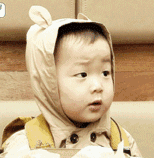|
|---|---|---|---|
|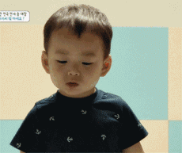||||
||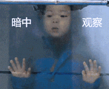||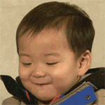|
|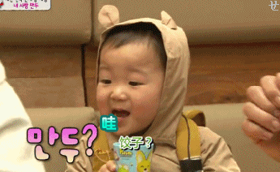|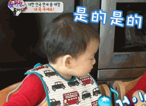||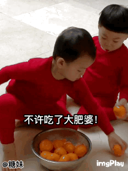|
|||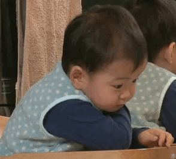|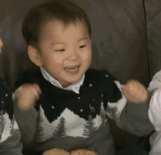|
|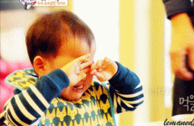|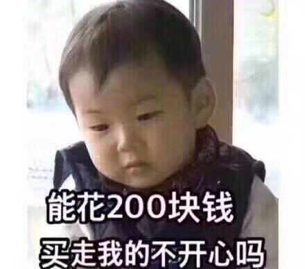|||
|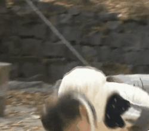|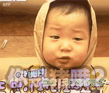|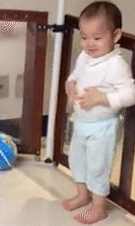|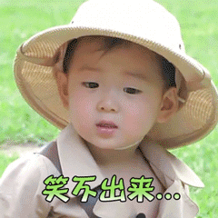|
|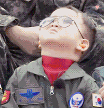|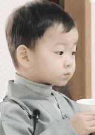|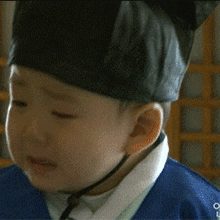|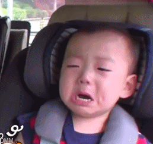|
|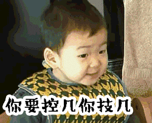|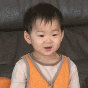|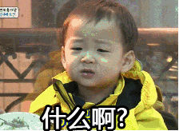|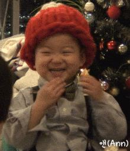|
|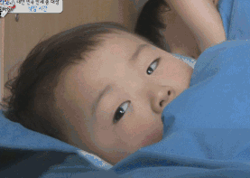|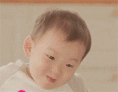|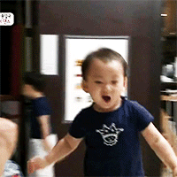|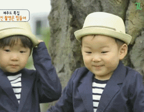|
|||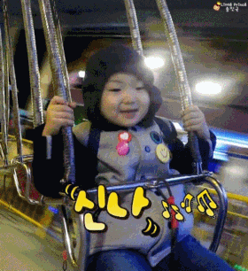|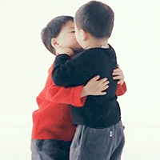|
|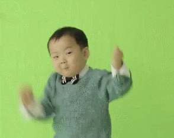|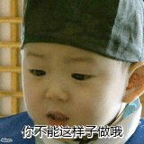|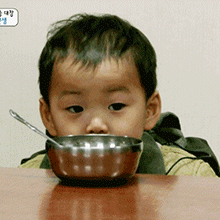|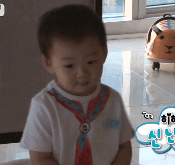|
|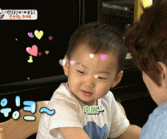|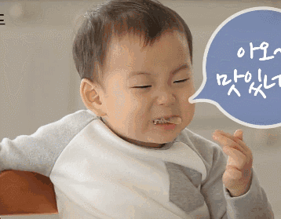|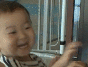||
||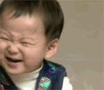|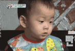|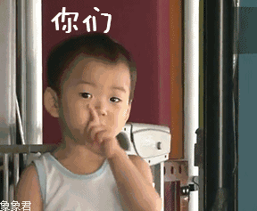|
|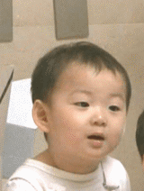|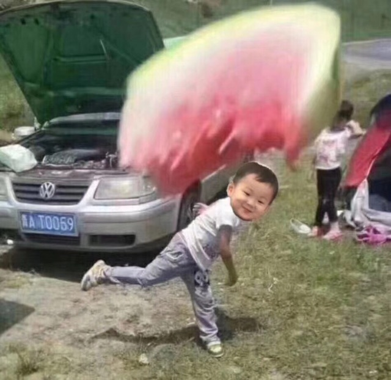|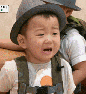||
|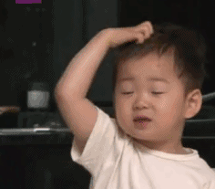|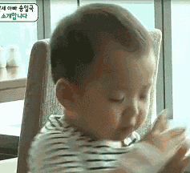|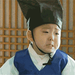|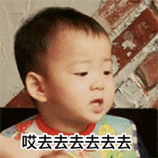|
|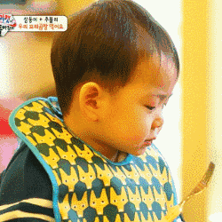|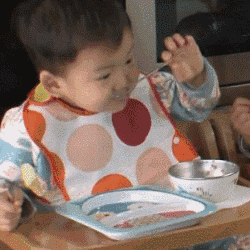|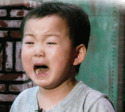|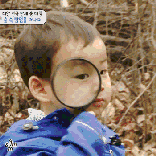|
|||||
|||||
|||||
|||||
|||||
|||||
|||||
|||||
|||||
|||||
|||||
|||||
|||||
|||||
|||||
|||||
|||||
|||||
|||||
|||||

